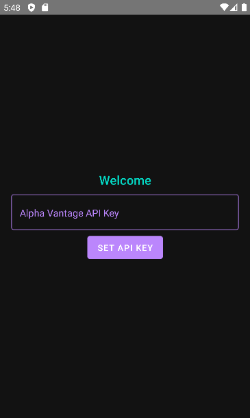
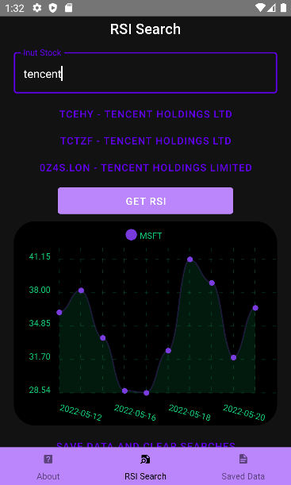
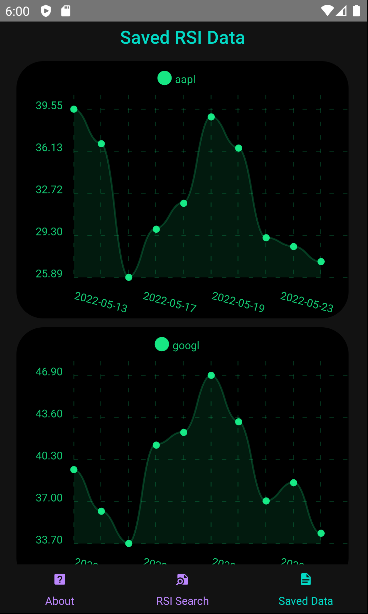
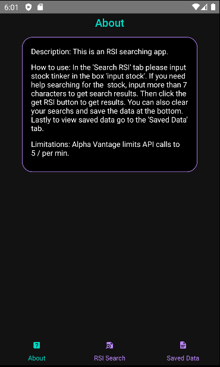

# RSI-Investment-App
This application is an investment app that utilizes the relative strength index. This project was created in react native using javascript. In addition, the project pulls stock data from the Alpha Vantage API.

## Features
* Search for stock by name or TINKER
* Display RSI data for specific stock
* Save data and clear searches
* Clear saved data

## How to use
On the welcome screens please input your alpha vantage api key so the app can use it for searching. Then in the 'Search RSI' tab please input stock tinker in the box 'input stock'. If you need help searching for the  stock, input more than 7 characters to get search results. Then click the get RSI button to get results. You can also clear your searchs and save the data at the bottom. To view saved data go to the 'Saved Data' tab. Lastly, to delete the saved data click the botton at the bottom of the saved data tab.

## Limitations
* Alpha Vantage limits API calls to 5 / per min.
    * API Call: Search stock by name where the text length is 7 characters
    * API Call: Getting specific stock data 

## Photo Examples





## Dependencies
```javascript
{"dependencies": {
    "@babel/preset-env": "^7.1.6",
    "@react-native-async-storage/async-storage": "^1.17.5",
    "@react-navigation/material-bottom-tabs": "^6.2.1",
    "@react-navigation/native": "^6.0.10",
    "@react-navigation/native-stack": "^6.6.2",
    "crypto": "^1.0.1",
    "react": "17.0.2",
    "react-native": "0.68.2",
    "react-native-cache": "^2.0.2",
    "react-native-chart-kit": "^6.12.0",
    "react-native-paper": "^4.12.1",
    "react-native-safe-area-context": "^3.0.0",
    "react-native-screens": "^3.13.1",
    "react-native-svg": "^12.3.0",
    "react-native-vector-icons": "^9.1.0",
    "request": "^2.88.2",
    "typescript": "^4.6.4",
    "uuid": "^8.3.2"
  },
  "devDependencies": {
    "@babel/core": "^7.12.9",
    "@babel/runtime": "^7.12.5",
    "@react-native-community/eslint-config": "^2.0.0",
    "babel-jest": "^26.6.3",
    "eslint": "^7.32.0",
    "jest": "^26.6.3",
    "metro-react-native-babel-preset": "^0.67.0",
    "react-test-renderer": "17.0.2"
  }
}
``` 
